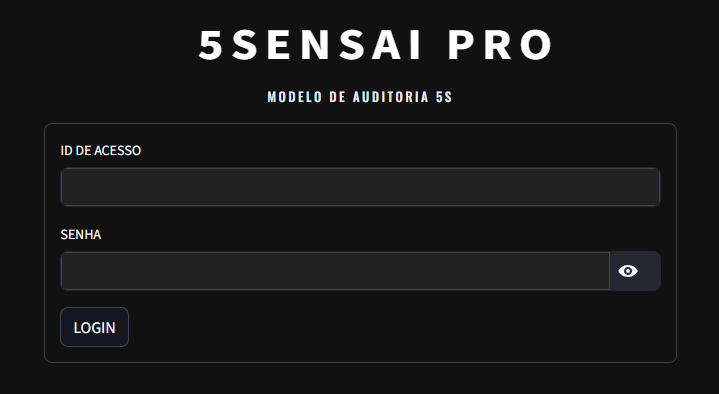
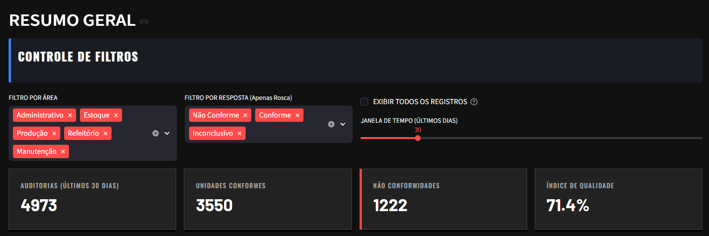
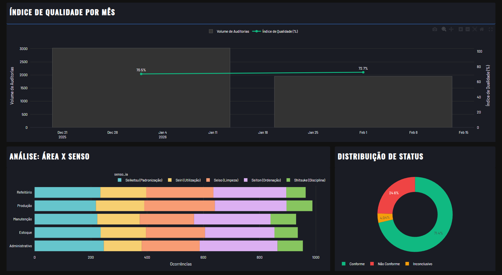
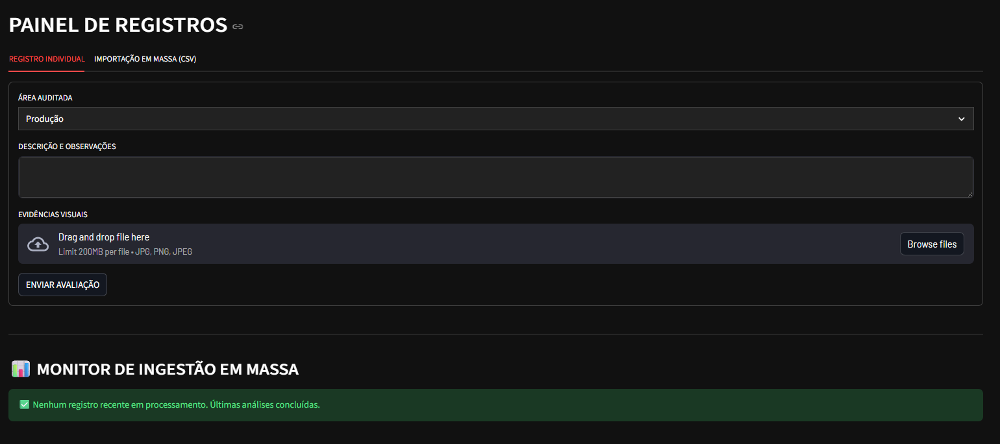
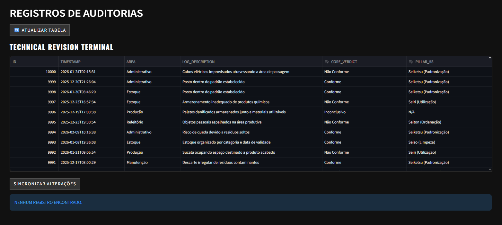

# ⛩️ 5SensAI - O Auditor Digital para sua Indústria

**5SensAI** é uma plataforma que utiliza Inteligência Artificial (NLP) para transformar auditorias 5S em dados acionáveis.

---

## 🖥️ Interface do Sistema

## ✨ Por que 5SensAI?

O processo de auditoria 5S costuma ser lento, manual e subjetivo. O 5SensAI resolve isso:

* **Classificação Automática**: Identifica conformidades e não-conformidades via texto.
* **Mapeamento de Sensos**: Aloca cada relato automaticamente em um dos 5 pilares do 5S.
* **Dashboard Titanium**: Visualização executiva para gerentes de planta com design industrial moderno.

## 🛠️ Stack Técnica

* **IA**: Scikit-Learn (TF-IDF + Logistic Regression).
* **Backend**: FastAPI (Python).
* **Frontend**: Streamlit com Design Customizado (Titanium UI).
* **Infraestrutura**: Docker & Docker Compose.

---

> ⚠️ **Nota**: Este repositório contém uma **versão de demonstração (Showcase)** para fins de portfólio. O motor de IA (5SensAI Engine), a lógica Multi-tenant e o processamento de dados em larga escala são protegidos por licença comercial.

---

## 📺 Demonstração em GIF

*Interessado em implementar a solução completa na sua unidade industrial? Entre em contato para uma demonstração.*
